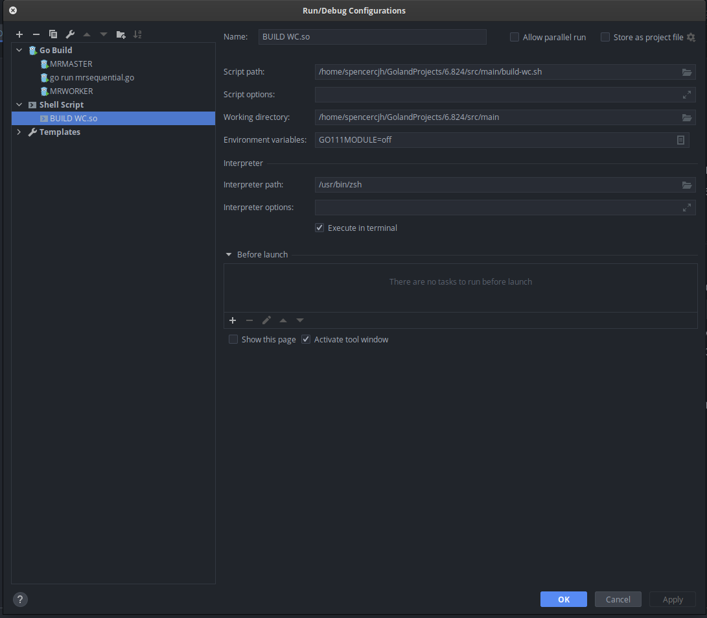
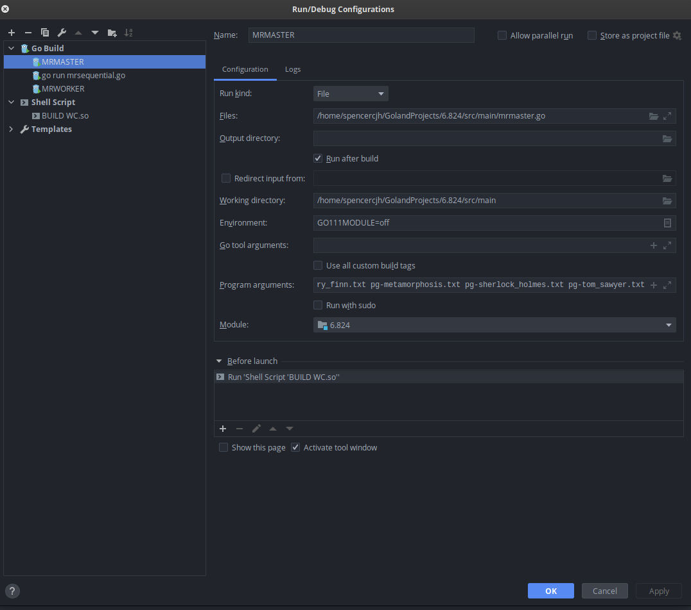
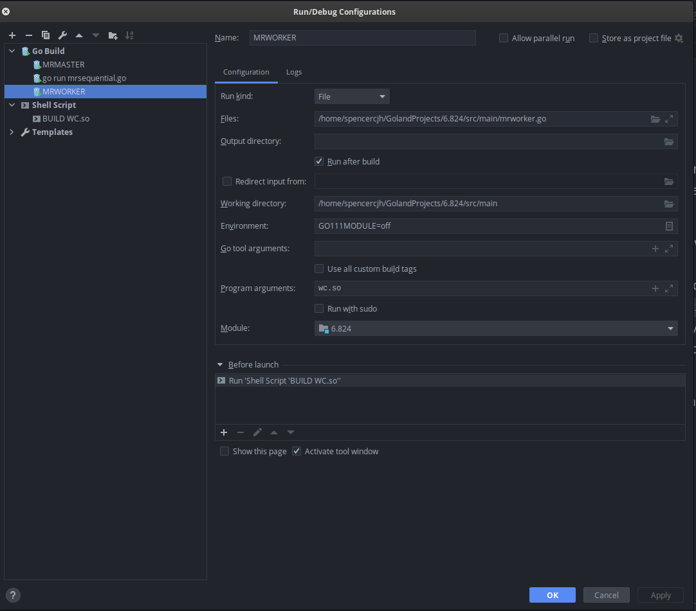

# MIT 6.824

It is my first time to learn other foreign universities' courses such as MIT 6.824. What a pity of not discovering these
treasures of knowledge earlier.

I have been writing Java and Python for a few years, but I am still a beginner to Golang. I participated in a piece of
function-scale Go codes in my previous internship. There are lots of problems when I executed the first
command `go build -buildmode=plugin ../mrapps/wc.go`
in my terminal but luckily I have solved it now and can get the result of `mr-out-0` then I decide to start recording my
lab process now.

Finally, after spending 2 days and reading the Map Reduce paper again roughly, I finally completed Lab 1 with Goland.

*But unfortunately, it is still not possible to debug worker code in Goland but debugging master is OK.*

Here is my running configuration:

